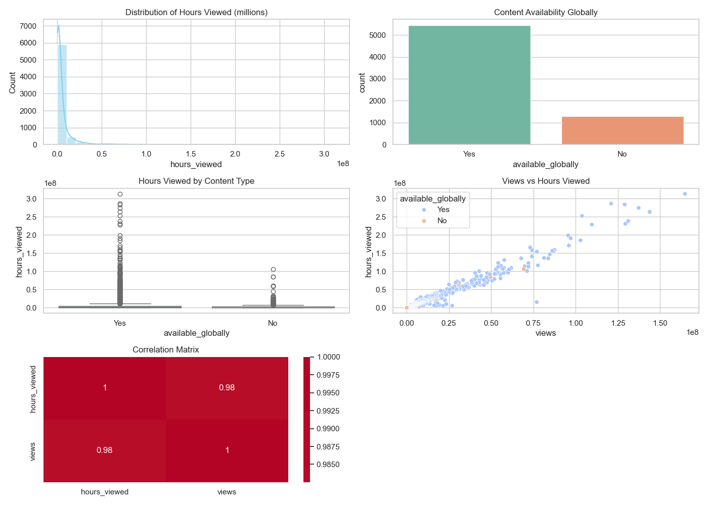

# 📊 Day 2: Exploratory Data Analysis with Pandas - Netflix Viewing Data

Welcome to **Day 2** of the **100 Days of Data Mastery**!  
Today we analyze Netflix's viewing patterns using Pandas, uncovering insights from **36,121 titles** in their engagement reports.

---

## 🎯 Objectives

- Perform comprehensive EDA on Netflix's viewing dataset
- Identify trends in global vs. limited releases
- Handle real-world data challenges (skewed distributions, 81% missing dates)
- Generate actionable insights through visualizations

---

## 🧰 Tools & Libraries

```python
# Data manipulation
import pandas as pd  
# Visualizations
import seaborn as sns  
# Custom functions
from pandas_utils import (  
    plot_histogram, 
    plot_correlation_matrix,
    save_combined_plots
)
```

Install requirements:  
```bash
pip install -r requirements.txt
```

---

## 📁 Folder Structure

```
Day2_Pandas_EDA/
│
├── README.md                # This overview
├── EDA_with_pandas.ipynb    # Complete analysis notebook
├── pandas_utils.py          # Custom visualization functions
├── requirements.txt
│
└── outputs/                 # Generated analysis artifacts
    ├── correlation_matrix.png
    ├── null_values_summary.txt
    └── eda_visualizations.png
```

---

## 🔍 Key Insights

### 1. Data Characteristics
```python
Shape: (36121, 8)
Missing Values:
- release_date: 29,396 nulls (81.4%)
- views: 12 nulls (0.03%)
```

### 2. Viewership Patterns
- **Globally available** titles average **3.17M views** vs **1.19M** for limited releases  
- **"Back in Action" (2025)** dominates with 313M hours viewed  
- 75% of titles have ≤1.9M hours viewed (right-skewed distribution)

### 3. Strong Correlation
```python
views vs hours_viewed: r = 0.98
```

---

## 📌 Key Code Snippets

### Data Cleaning Pipeline
```python
cleaned_data = (data_movies
    .dropna()
    .drop(columns=['runtime'])
    .rename(columns={'title':'movie_title'})
```

### Feature Engineering
```python
data['hours_viewed_million'] = data['hours_viewed'] / 1e6
```

### Critical Visualization
```python
plot_boxplot(cleaned_data, 
             x_column="available_globally", 
             y_column="hours_viewed")
```

---

## 📊 Sample Outputs

| Visualization | Insight |
|--------------|---------|
|  | EDA Visualization |

---

## 🚀 What's Next?

**Day 3** will explore:  
- Time-series analysis of release patterns  
- Advanced feature engineering  
- Predictive modeling for viewership  

---

## ✅ How to Run
```bash
git clone https://github.com/DavidCalebChaparroOrozco/100DaysofDataMastery.git
cd 100DaysofDataMastery/Day2_Pandas_EDA
```

---

### 🔗 Credits
Dataset sourced from [TidyTuesday](https://github.com/rfordatascience/tidytuesday/tree/main/data/2025/2025-07-29), originally from Netflix's engagement reports.

---
**Key Takeaway**: Netflix's viewership follows a "hit-driven" pattern where global availability significantly boosts engagement, while most titles garner modest viewership.
--- 